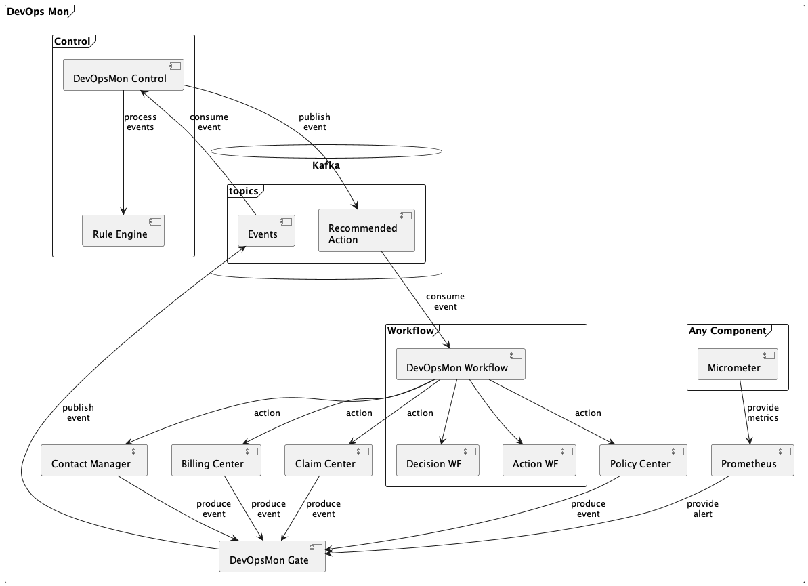

#Building Block View

## Whitebox Overall System

## Events
|System| Event |
|---|---|
|Bitbucket| check-out |
|Bitbucket| check-in|
|Jenkins| build|
|Nexus|release|
|OpenShift|deploy|

## Metrics
The following chapters describe samples for metrics we are interested in.
### Benefits
Metrics describing benefits are used to create positive emotions on the systems and work.

|Name| Description |
|---|-------------|
|Amount of Offers| tbd         |
|Bound Submissions| tbd|
|Premium per day/month/year| tbd|

### Cost Control
Cost control merics should help to continously measure and optimize costs using teh underlying platforms.

| Name      |Description|
|-----------|---|
| RAM used  | tbd|
| Disk used | tbd|
|CPU used | tbd |

### User
User metrics should indicate what users do.

|Name|Description|
|---|---|
|Login|tbd|
|Logout| tbd|

### Asset Metrics
| Name      |Description|
|-----------|---|
| started   |Container, REST, Batch|
| crashed   |Container, REST, Batch|
| stopped   |Container, REST, Batch|
| restarted |Container, REST, Batch|

### Business
| Name      | Description      |
|-----------|------------------|
|Duration of operation| business process |

### Failure
| Name      |Description|
|-----------|---|
|MTBF|Meantime between failure|
|Amount of exceptions| tbd|